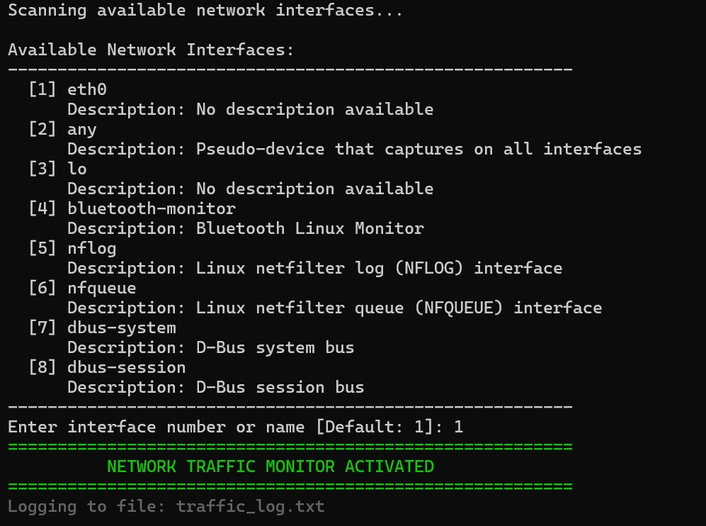
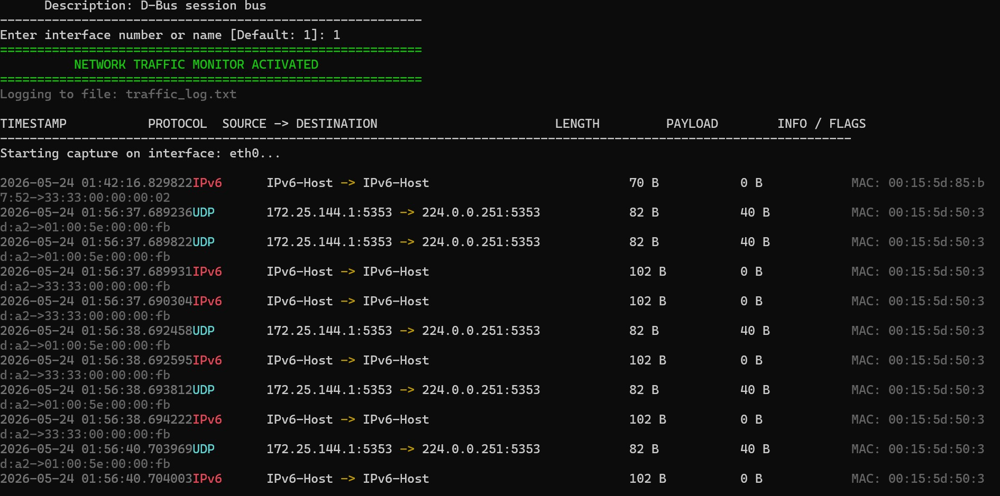
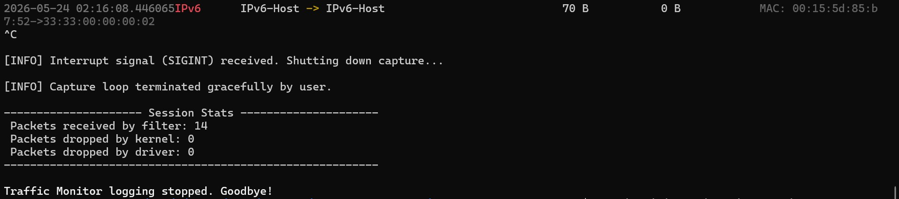

# 📡 Network Traffic Monitor

A high-performance, real-time network packet analyzer and parser built in C++17 utilizing `libpcap` for robust link-layer capturing and BPF-compliant packet filtering.

[](https://en.cppreference.com/w/cpp/17)
[](https://www.kernel.org/)
[](https://www.tcpdump.org/)

---

## 🚀 Features

* ⚡ **Live Packet Capture:** Capture Ethernet packets in promiscuous mode from any active network adapter.
* 🔍 **Deep Packet Inspection (DPI):** Thorough parsing of protocol headers across layers:
  * 📦 **Layer 2 (Ethernet):** Formats source/destination MAC addresses and decodes frame types.
  * 🌐 **Layer 3 (IP/Network):** Handles IPv4 (parsing IPs and protocol IDs), IPv6, and ARP protocols.
  * ⚙️ **Layer 4 (Transport):** Decodes TCP (ports, flag states like `SYN`, `ACK`, `FIN`, `RST`, and payload sizes), UDP (ports, packet sizes), and ICMP packet types.
* 🎨 **Real-Time Stylized Dashboard:** Colorized ANSI-escaped terminal grid displaying key network flows live.
* 💾 **Structured Thread-Safe Logging:** Flushes clean, structured, non-escaped records to a dedicated log file (`traffic_log.txt`) backed by a thread-safe `std::mutex`.
* 🛡️ **Graceful Signal Handling:** Catches `Ctrl+C` (`SIGINT`) to break the capture loop safely and prints diagnostic session statistics (packets received, kernel drops, driver drops).

---

## ⚙️ Tech Stack

| Component | Technology / Library | Description |
| :--- | :--- | :--- |
| **Language** | C++17 | Modern C++ standard with standard optimization flags |
| **Packet Capture** | `libpcap` | POSIX standard packet capture and BPF filtering |
| **Compiler** | `g++` | GNU C++ compiler with `-O3`, `-Wall`, `-Wextra` |
| **Platform** | Linux / WSL | Native Linux environment or WSL distribution |
| **Build System** | Makefile | Standard UNIX Makefile automated compilation |

---

## 📋 Prerequisites & Installation

### 1. Install Dependencies
On Debian/Ubuntu-based systems (including WSL), install the required build tools and packet capture development libraries:
```bash
sudo apt update && sudo apt install -y build-essential libpcap-dev
```

### 2. Compile the Project
Build the executable using the provided `Makefile`:
```bash
make clean && make
```
This compiles the source code into a high-performance `traffic_monitor` binary in the local directory.

---

## 🚀 Usage

> [!IMPORTANT]
> **Root/Sudo Privileges Required:** Because network packet capture requires low-level raw socket access and putting network interface cards into promiscuous mode, the executable must be run with **root privileges (`sudo`)**.

```bash
# Standard Interactive Mode (scans and lists available interfaces)
sudo ./traffic_monitor

# Specify a custom interface and apply a filter (e.g. capture only HTTPS traffic on eth0)
sudo ./traffic_monitor -i eth0 -f "tcp port 443"

# Specify a custom log file
sudo ./traffic_monitor -l custom_traffic.log
```

### Command Line Flags
| Short Flag | Long Flag | Description |
| :--- | :--- | :--- |
| `-i` | `--interface` | Specify target network interface (e.g., `eth0`, `wlan0`). |
| `-f` | `--filter` | BPF packet filter expression (e.g., `tcp`, `udp`, `port 80`). |
| `-l` | `--log` | Structured text file log path (Default: `traffic_log.txt`). |
| `-h` | `--help` | Display usage instructions and examples. |

---

## 🖼️ Screenshots


*Interface Selection*


*Live Capture*


*Session Statistics*

---

## 📁 Project Structure

```text
network-traffic-monitor/
├── Makefile                  # Build script configured for Linux compilation with g++ and libpcap
├── main.cpp                  # Entry point, command-line arguments parsing, interactive interface scanner
├── CaptureEngine.hpp         # CaptureEngine class declarations (pcap handler definitions)
├── CaptureEngine.cpp         # CaptureEngine class definitions (live capture loop & datalink checks)
├── PacketParser.hpp          # PacketParser class declarations (parsed metadata structures)
├── PacketParser.cpp          # PacketParser class definitions (Ethernet/IP/TCP/UDP/ICMP parsing logic)
├── TrafficLogger.hpp         # TrafficLogger class declarations (multithreading protection definitions)
├── TrafficLogger.cpp         # TrafficLogger class definitions (terminal live formatter & text file output)
└── screenshots/              # Screenshot folder containing live capture visuals
    ├── interface_selection.jpg
    ├── live_capture.jpg
    └── session_stats.jpg
```
